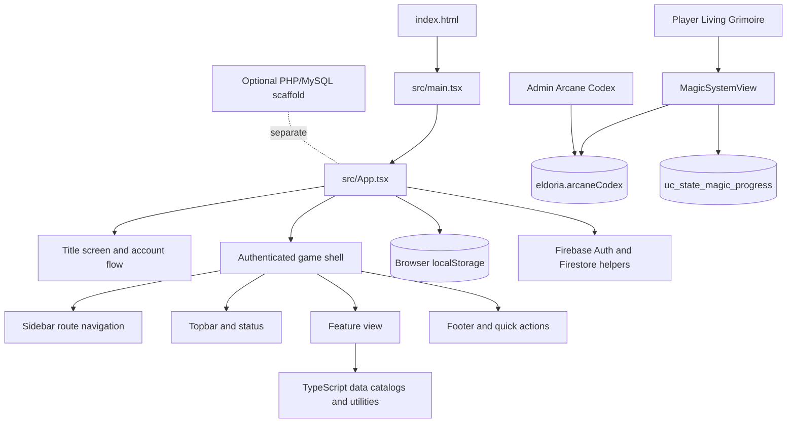

# Eldoria: Realms at War — Application Architecture

This document describes the checked-in browser application. It does not imply a live authoritative game server.

## Runtime Shape

## Responsibilities

- **`src/main.tsx`** mounts the React application and global stylesheet.
- **`src/App.tsx`** owns top-level login state, game state, route selection, timers, persistence effects, and feature-view composition.
- **`src/components/Sidebar.tsx`** defines the visible navigation groups and route IDs.
- **`src/components/Topbar.tsx`**, **`Footer.tsx`**, and **`HudMetrics.tsx`** provide persistent shell and status UI.
- **`src/components/views/`** contains route-level gameplay and administration views.
- **`src/types.ts`**, `src/gameData.ts`, and feature data modules define shared models and starting catalogs.
- **`src/utils/`** contains calculations reused by views and application state.
- **`src/firebase.ts`** initializes the Firebase client and provides authentication and limited Firestore helpers.

## State Flow

A route-level view receives state and callbacks from `App.tsx`. User actions call those callbacks; React state is updated, and persistence effects write selected state to `localStorage`. Profile and resource effects also invoke the Firestore helper when an authenticated Firebase user exists. Most other subsystems remain browser-local.

## Authentication Boundary

The title screen has account and wanderer entry flows. Firebase Authentication state is observed by the client. Admin views add another client-side session gate, while Firestore rules separately control cloud document access. Client-side visibility checks are not a security boundary for server data.

## Architectural Caveats

- A route, data model, or menu label does not prove that a feature is backed by a remote service.
- Some identifiers and data files retain names from earlier prototypes.
- The PHP/MySQL scaffold is not wired into the React application by default.
- Keep diagrams conceptual and update them when route ownership or persistence changes.

See [Components Architecture](docs/COMPONENTS_ARCHITECTURE.md), [State and Persistence](docs/STATE_MANAGEMENT_AND_ENGINE.md), and [API and Data](API_AND_DATA_SPEC.md).
