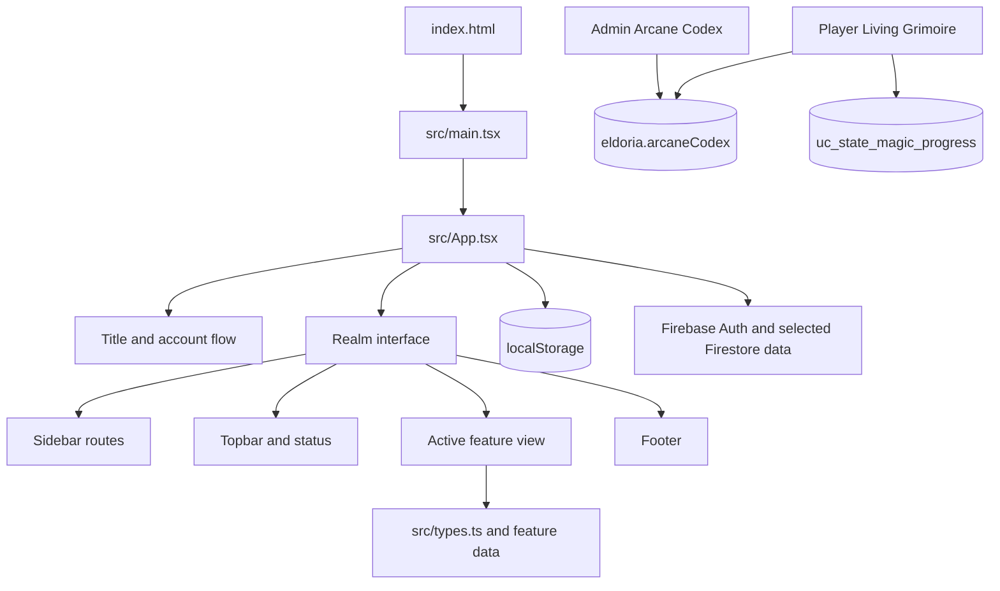
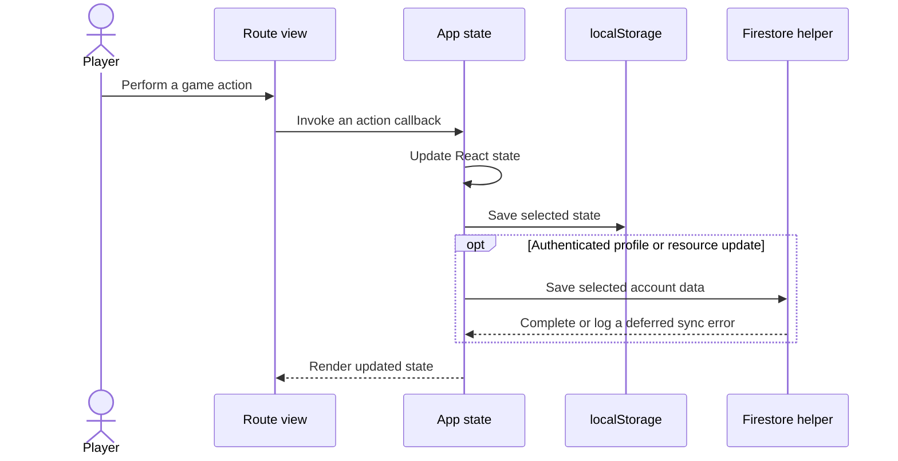
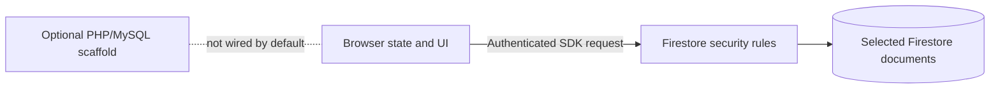

# Eldoria Architecture Diagrams

These diagrams show the current client boundaries at a high level. They intentionally omit internal route details that change frequently.

## Application Composition

## Persistence Flow

## Trust Boundaries

For route ownership and contract details, see [Architecture](../ARCHITECTURE_UML.md) and [API and Data](../API_AND_DATA_SPEC.md).
